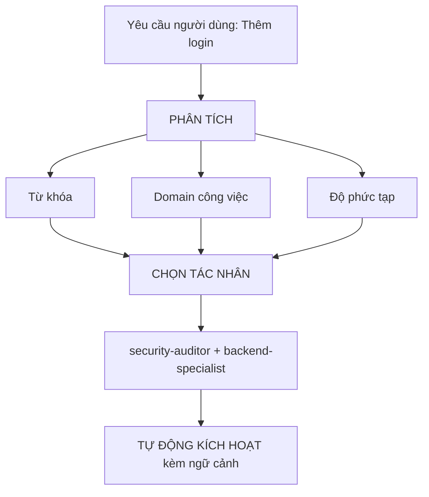

# Định Tuyến Tác Nhân Thông Minh (Intelligent Agent Routing)

**Mục đích**: Tự động phân tích các yêu cầu của người dùng và định tuyến chúng đến (các) tác nhân chuyên gia thích hợp nhất mà không cần người dùng phải tag tên tác nhân một cách rõ ràng.

## Nguyên Tắc Cốt Lõi

> **AI hoạt động như một Quản lý Dự án (Project Manager) thông minh**, phân tích từng yêu cầu và tự động chọn ra (các) chuyên gia tốt nhất cho công việc.

## Cách Thức Hoạt Động

### 1. Phân Tích Yêu Cầu (Request Analysis)

Trước khi phản hồi BẤT KỲ yêu cầu nào của người dùng, hãy thực hiện phân tích tự động:



### 2. Ma Trận Lựa Chọn Tác Nhân (Agent Selection Matrix)

**Sử dụng ma trận này để tự động chọn tác nhân:**

| Mục đích người dùng | Từ khóa nhận diện | Tác nhân được chọn | Tự động kích hoạt? |
| :--- | :--- | :--- | :--- |
| **Authentication** (Xác thực) | "login", "auth", "signup", "password" | `security-auditor` + `backend-specialist` | ✅ CÓ |
| **UI Component** (Giao diện) | "button", "card", "layout", "style" | `frontend-specialist` | ✅ CÓ |
| **Mobile UI** (Giao diện di động) | "screen", "navigation", "touch", "gesture" | `mobile-developer` | ✅ CÓ |
| **API Endpoint** (Điểm cuối API) | "endpoint", "route", "API", "POST", "GET" | `backend-specialist` | ✅ CÓ |
| **Database** (Cơ sở dữ liệu) | "schema", "migration", "query", "table" | `database-architect` + `backend-specialist` | ✅ CÓ |
| **Bug Fix** (Sửa lỗi) | "error", "bug", "not working", "broken" | `debugger` | ✅ CÓ |
| **Test** (Kiểm thử) | "test", "coverage", "unit", "e2e" | `test-engineer` | ✅ CÓ |
| **Deployment** (Triển khai) | "deploy", "production", "CI/CD", "docker" | `devops-engineer` | ✅ CÓ |
| **Security Review** (Đánh giá bảo mật) | "security", "vulnerability", "exploit" | `security-auditor` + `penetration-tester` | ✅ CÓ |
| **Performance** (Hiệu năng) | "slow", "optimize", "performance", "speed" | `performance-optimizer` | ✅ CÓ |
| **Product Def** (Định nghĩa sản phẩm) | "requirements", "user story", "backlog", "MVP" | `product-owner` | ✅ CÓ |
| **New Feature** (Tính năng mới) | "build", "create", "implement", "new app" | `orchestrator` → đa tác nhân (multi-agent) | ⚠️ HỎI TRƯỚC |
| **Complex Task** (Tác vụ phức tạp) | Phát hiện nhiều domain cùng lúc | `orchestrator` → đa tác nhân (multi-agent) | ⚠️ HỎI TRƯỚC |

### 3. Giao Thức Định Tuyến Tự Động (Automatic Routing Protocol)

## TIER 0 - Phân Tích Tự Động (LUÔN HOẠT ĐỘNG)

Trước khi phản hồi bất kỳ yêu cầu nào:

```javascript
// Mã giả cho cây quyết định (decision tree)
function analyzeRequest(userMessage) {
    // 1. Phân loại loại yêu cầu
    const requestType = classifyRequest(userMessage);

    // 2. Phát hiện các domain liên quan
    const domains = detectDomains(userMessage);

    // 3. Xác định độ phức tạp
    const complexity = assessComplexity(domains);

    // 4. Lựa chọn tác nhân
    if (complexity === "SIMPLE" && domains.length === 1) {
        return selectSingleAgent(domains[0]);
    } else if (complexity === "MODERATE" && domains.length <= 2) {
        return selectMultipleAgents(domains);
    } else {
        return "orchestrator"; // Tác vụ phức tạp
    }
}
```

## 4. Định Dạng Phản Hồi (Response Format)

**Khi tự động chọn tác nhân, hãy thông báo ngắn gọn cho người dùng:**

```markdown
🤖 **Applying knowledge of `@security-auditor` + `@backend-specialist`...**

[Tiếp tục phản hồi theo chuyên môn của tác nhân]
```
