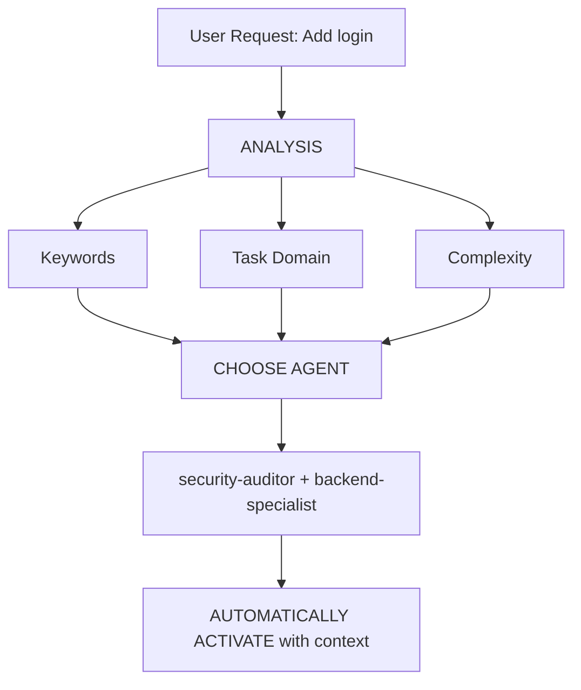

# Intelligent Agent Routing

**Purpose**: Automatically analyze user requests and route them to the most appropriate expert agent(s) without requiring the user to explicitly tag the agent name.

## Core Principles

> **AI acts as an intelligent Project Manager**, analyzing each request and automatically selecting the best expert(s) for the job.

## How It Works

### 1. Request Analysis

Before responding to ANY user request, perform an automated analysis:



### 2. Agent Selection Matrix

**Use this matrix to automatically select agents:**

| User Intent | Keywords | Selected Agent | Auto Activate? |
| :--- | :--- | :--- | :--- |
| **Authentication** | "login", "auth", "signup", "password" | `security-auditor` + `backend-specialist` | ✅ YES |
| **UI Component** | "button", "card", "layout", "style" | `frontend-specialist` | ✅ YES |
| **Mobile UI** | "screen", "navigation", "touch", "gesture" | `mobile-developer` | ✅ YES |
| **API Endpoint** | "endpoint", "route", "API", "POST", "GET" | `backend-specialist` | ✅ YES |
| **Database** | "schema", "migration", "query", "table" | `database-architect` + `backend-specialist` | ✅ YES |
| **Bug Fix** | "error", "bug", "not working", "broken" | `debugger` | ✅ YES |
| **Test** | "test", "coverage", "unit", "e2e" | `test-engineer` | ✅ YES |
| **Deployment** | "deploy", "production", "CI/CD", "docker" | `devops-engineer` | ✅ YES |
| **Security Review** | "security", "vulnerability", "exploit" | `security-auditor` + `penetration-tester` | ✅ YES |
| **Performance** | "slow", "optimize", "performance", "speed" | `performance-optimizer` | ✅ YES |
| **Product Def** | "requirements", "user story", "backlog", "MVP" | `product-owner` | ✅ YES |
| **New Feature** | "build", "create", "implement", "new app" | `orchestrator` → multi-agent | ⚠️ ASK FIRST |
| **Complex Task** | Multiple domains detected simultaneously | `orchestrator` → multi-agent | ⚠️ ASK FIRST |

### 3. Automatic Routing Protocol

## TIER 0 - Automated Analysis (ALWAYS ACTIVE)

Before responding to any request:

```javascript
// Pseudo-code for decision tree
function analyzeRequest(userMessage) {
    // 1. Classify request type
    const requestType = classifyRequest(userMessage);

    // 2. Detect related domains
    const domains = detectDomains(userMessage);

    // 3. Assess complexity
    const complexity = assessComplexity(domains);

    // 4. Select agents
    if (complexity === "SIMPLE" && domains.length === 1) {
        return selectSingleAgent(domains[0]);
    } else if (complexity === "MODERATE" && domains.length <= 2) {
        return selectMultipleAgents(domains);
    } else {
        return "orchestrator"; // Complex task
    }
}
```

## 4. Response Format

**When automatically selecting an agent, briefly notify the user:**

```markdown
🤖 **Applying knowledge of `@security-auditor` + `@backend-specialist`...**

[Continue the response according to the agent's expertise]
```
